# Nebula Measurement Results Calendar Week 0 - 2023

## Table of Contents

- [Nebula Measurement Results Calendar Week 0 - 2023](#nebula-measurement-results-calendar-week-0---2023)
  - [Table of Contents](#table-of-contents)
  - [General Information](#general-information)
    - [Agent Versions](#agent-versions)
    - [Protocols](#protocols)
    - [Classification](#classification)
    - [Top 10 Rotating Nodes](#top-10-rotating-nodes)
    - [Crawls](#crawls)
      - [Overall](#overall)
      - [By Agent Version](#by-agent-version)
  - [Churn](#churn)
  - [Inter Arrival Time](#inter-arrival-time)
  - [Agent Version Analysis](#agent-version-analysis)
    - [Overall](#overall-1)
    - [Kubo](#kubo)
    - [Classification](#classification-1)
  - [Geo location](#geo-location)
    - [Unique IP Addresses](#unique-ip-addresses)
    - [Classification](#classification-2)
    - [Agents](#agents)
  - [Datacenters](#datacenters)
    - [Overall](#overall-2)
    - [Agents](#agents-1)
  - [Top Updating Peers](#top-updating-peers)
    - [Node classification:](#node-classification)
    - [IP Resolution Classification:](#ip-resolution-classification)
    - [Cloud Providers](#cloud-providers)
    - [Storm Specific Protocols](#storm-specific-protocols)

## General Information

The following results show measurement data that were collected in calendar week 0 in 2023 from `2022-12-26` to `2023-01-02`.

- Number of crawls `336`
- Number of visits `30,855,035`
  > Visiting a peer means dialing or connecting to it. Every time the crawler or monitoring process tries to dial or connect to a peer we consider this as _visiting_ it. Regardless of errors that may occur.
- Number of unique peer IDs visited `35,695`
- Number of unique IP addresses found `59,827`

Timestamps are in UTC if not mentioned otherwise.

### Agent Versions

Newly discovered agent versions:

- `kubo/0.19.0-dev/` (2022-12-26 07:21:27)
- `tcm@55988e61f-dirty` (2022-12-26 15:22:54)
- `kubo/0.18.0-dev/4648cb645` (2022-12-27 18:52:10)
- `wgp2p@` (2022-12-28 13:22:30)
- `kubo/0.19.0-dev/1cad941-dirty` (2022-12-29 07:51:21)
- `github.com/ethtweet/ethtweet@` (2022-12-29 07:52:27)
- `kubo/0.19.0-dev/c2d82a6-dirty` (2022-12-29 09:21:17)
- `kubo/0.15.0-dev/8059761bb` (2022-12-29 23:21:22)
- `github.com/libp2p/go-libp2p/examples@` (2022-12-30 02:21:39)
- `github.com/ethtweet/ethtweet@cc9d75283-dirty` (2022-12-30 11:21:43)
- `kubo/0.17.0-rc1/3d2a764` (2022-12-30 14:22:31)
- `go-ipfs/0.12.0/cd3e791` (2022-12-30 19:51:55)
- `go-ipfs/0.12.1/da2b9bd71` (2022-12-30 19:52:36)
- `go-ipfs/0.12.0/cd3e791-dirty` (2022-12-31 04:51:21)
- `kubo/0.19.0-dev/2d45b2d4d-dirty` (2023-01-01 21:51:18)

Agent versions that were found to support at least one [storm specific protocol](#storm-specific-protocols):

- `go-ipfs/0.8.0/48f94e2`
- `storm`

### Protocols

Newly discovered protocols:

- `/p2p/rpc/wgp2p/Public` (2022-12-28 13:22:30)
- `/chat/1.1.0` (2022-12-30 02:21:39)

### Classification

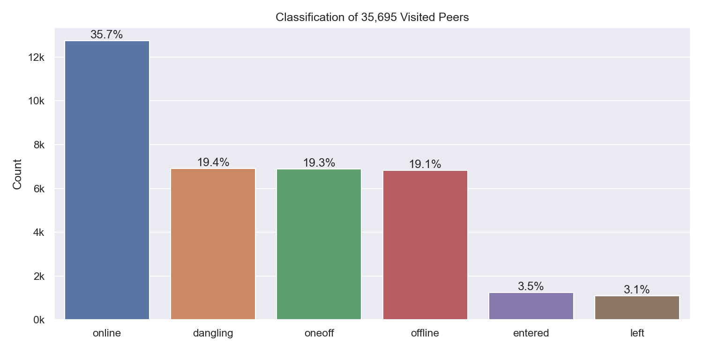

Peer classification:

| Classification | Description |
| --- | --- |
| `offline` | A peer that was never seen online during the measurement period (always offline) but found in the DHT |
| `dangling` | A peer that was seen going offline and online multiple times during the measurement period |
| `oneoff` | A peer that was seen coming online and then going offline **only once** during the measurement period |
| `online` | A peer that was not seen offline at all during the measurement period (always online) |
| `left` | A peer that was online at the beginning of the measurement period, did go offline and didn't come back online |
| `entered` | A peer that was offline at the beginning of the measurement period but appeared within and didn't go offline since then |

### Top 10 Rotating Nodes

| IP-Address    | Country | Unique Peer IDs | Agent Versions | Datacenter IP |
|:------------- |:------- | ---------------:|:-------------- | ------------- |
| `2001:41d0:304:200::25e6` | FR | 1101 | ['kubo/0.17.0/4485d6b71']| True  |
| `51.178.43.200` | FR | 1101 | ['kubo/0.17.0/4485d6b71']| True  |
| `146.59.151.243` | FR | 732 | ['kubo/0.16.0/38117db6f']| True  |
| `2001:41d0:304:200::de76` | FR | 732 | ['kubo/0.16.0/38117db6f']| True  |
| `186.152.208.208` | AR | 63 | ['go-ipfs/0.8.0/48f94e2']| False  |
| `27.130.255.222` | TH | 48 | ['go-ipfs/0.7.0/', 'kubo/0.16.0/', 'kubo/0.17.0/']| False  |
| `178.132.7.102` | NL | 46 | ['go-ipfs/0.8.0/48f94e2', 'rust-libp2p/0.7.0', 'rust-libp2p-server/0.6.0', 'storm']| True  |
| `27.130.255.221` | TH | 45 | ['go-ipfs/0.7.0/', 'kubo/0.16.0/', 'kubo/0.17.0/']| False  |
| `203.222.19.19` | TW | 44 | ['go-ipfs/0.8.0/48f94e2']| False  |
| `59.26.142.157` | KR | 40 | ['go-ipfs/0.8.0/48f94e2']| False  |

> A "rotating nodes" is a node (as identified by a single IP address) that was found with multiple peer IDs.

### Crawls

#### Overall

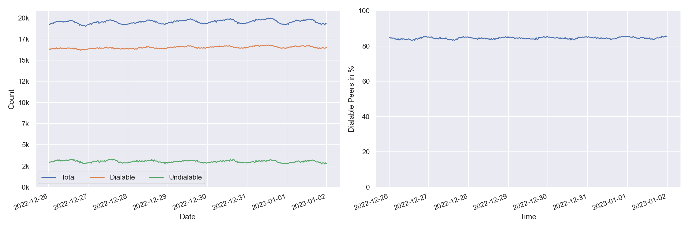

#### By Agent Version

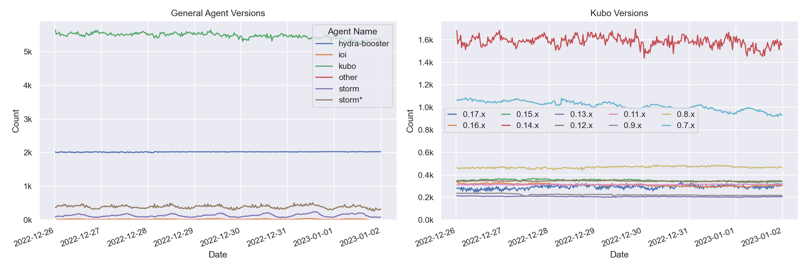

> Only the top 10 kubo versions appear in the right graph (due to lack of colors). The `0.8.x` versions do not contain disguised storm peers.

> `storm*` are `go-ipfs/0.8.0/48f94e2` peers that support at least one [storm specific protocol](#storm-specific-protocols).

## Churn

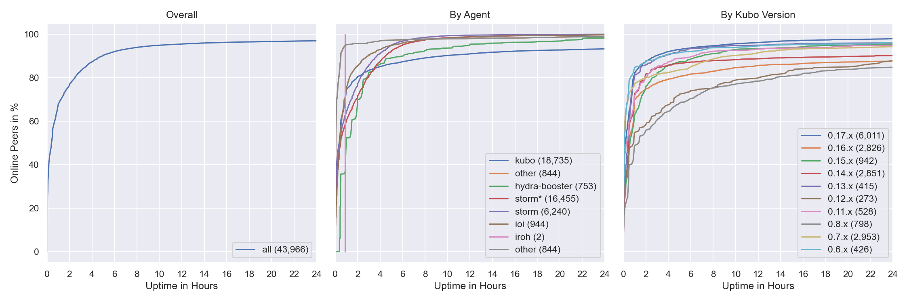

## Inter Arrival Time

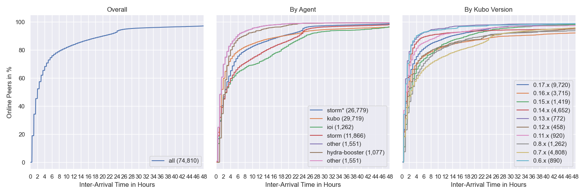

## Agent Version Analysis

### Overall

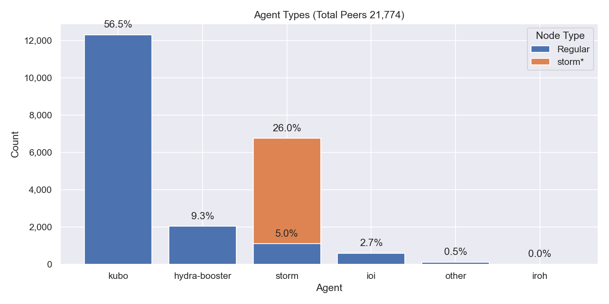

> Includes all peers that the crawler was able to connect to at least once (`dangling`, `online`, `oneoff`, `entered`)

### Kubo

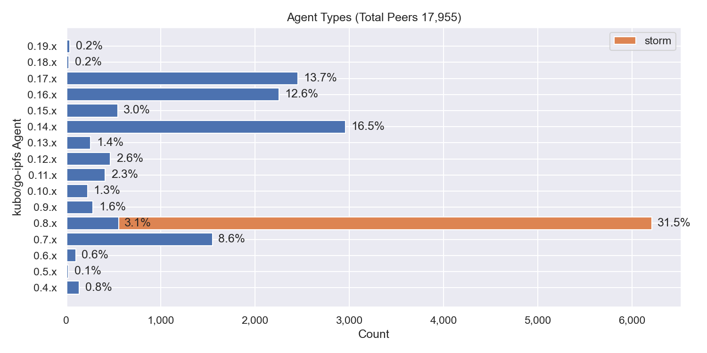

### Classification

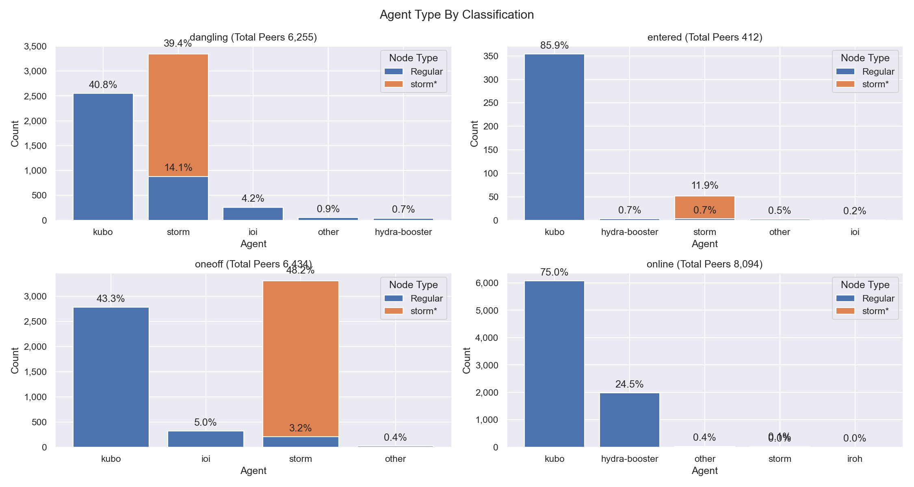

## Geo location

### Unique IP Addresses

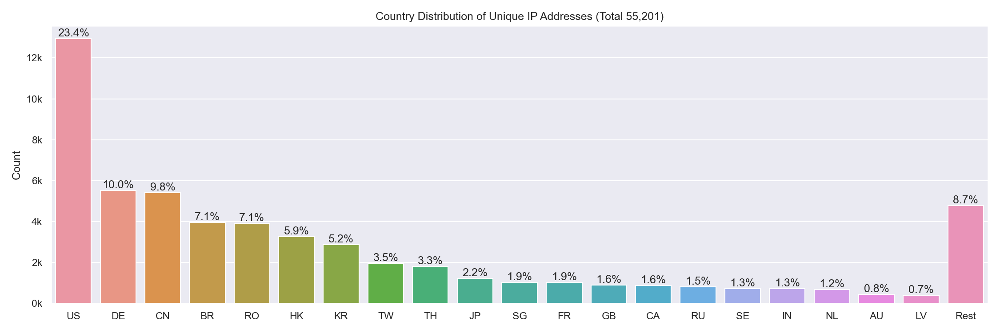

### Classification

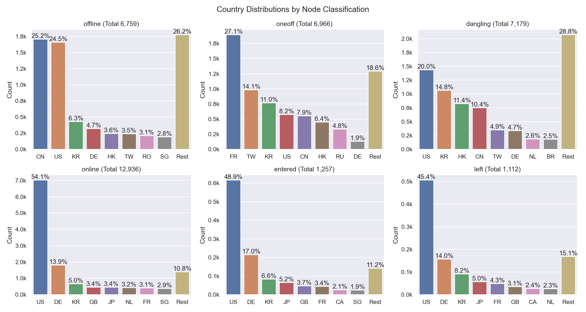

### Agents

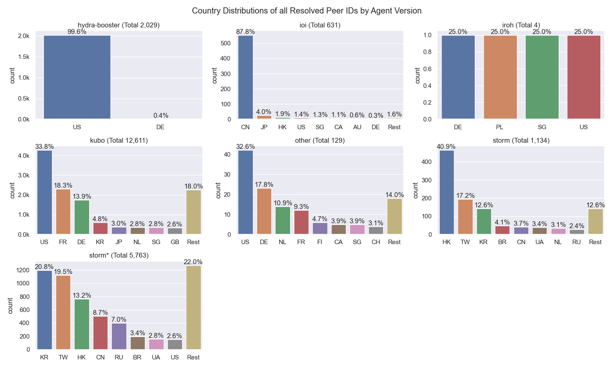

## Datacenters

### Overall

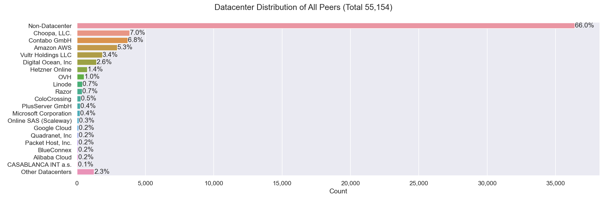

### Agents

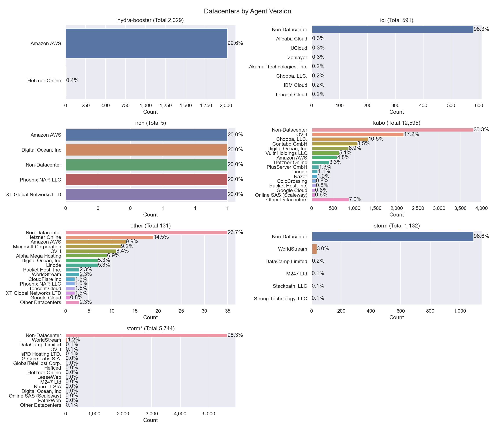

## Top Updating Peers

| Peer ID           | Final AV     | # Transitions | Distinct AVs | # Distinct AVs |
|:----------------- |:------------ | ------------- |:------------ | -------------- |
| `12D3KooWQcDBKQcu...` | `go-ipfs/0.8.0/` | 102  | go-ipfs/0.11.0/ go-ipfs/0.8.0/ | 2 |
| `12D3KooWNgxATDv4...` | `go-ipfs/0.13.0/` | 92  | go-ipfs/0.13.0/ go-ipfs/0.8.0/ | 2 |
| `12D3KooWAmVgeLTa...` | `go-ipfs/0.11.0/` | 75  | go-ipfs/0.11.0/ go-ipfs/0.12.0/ | 2 |
| `12D3KooWHPSQJQhE...` | `kubo/0.16.0/38117db` | 33  | kubo/0.14.0/ kubo/0.16.0/38117db | 2 |
| `12D3KooWNCc5wiFC...` | `kubo/0.19.0-dev/` | 3  | kubo/0.19.0-dev/ kubo/0.19.0-dev/1cad941-dirty kubo/0.19.0-dev/c2d82a6-dirty | 3 |
| `12D3KooWHMfFhJSo...` | `kubo/0.17.0/4485d6b71` | 2  | kubo/0.17.0/ kubo/0.17.0/4485d6b71 | 2 |
| `12D3KooWM4PddDjH...` | `kubo/0.16.0/` | 2  | kubo/0.16.0/ kubo/0.17.0/4485d6b71 | 2 |
| `QmRX5RjSEBqPsRw1...` | `kubo/0.16.0/` | 2  | kubo/0.16.0/ kubo/0.17.0/ | 2 |
| `12D3KooWSfG5B3yt...` | `kubo/0.17.0/4485d6b` | 1  | kubo/0.17.0/4485d6b | 1 |
| `12D3KooWFDyXhzeV...` | `kubo/0.17.0/` | 1  | kubo/0.17.0/ | 1 |

> `AV` = `Agent Version`
 
- `# Final AV` - The last agent version that was observed in this measurement period
- `# Transitions` - How often did this particular peer change its agent version
- `Distinct AVs` - Distinct agent version that this peer transitioned between (could have had a single AV multiple times) 

### Node classification:

- `offline` - A peer that was never seen online during the measurement period (always offline) but found in the DHT
- `dangling` - A peer that was seen going offline and online multiple times during the measurement period
- `oneoff` - A peer that was seen coming online and then going offline only once during the measurement period multiple times
- `online` - A peer that was not seen offline at all during the measurement period (always online)
- `left` - A peer that was online at the beginning of the measurement period, did go offline and didn't come back online
- `entered` - A peer that was offline at the beginning of the measurement period but appeared within and didn't go offline since then

### IP Resolution Classification:

- `resolved` - The number of peer IDs that could be resolved to at least one IP address (excludes peers that are only reachable by circuit-relays)
- `unresolved` - The number of peer IDs that could not or just were not yet resolved to at least one IP address
- `no public ip` - The number of peer IDs that were found in the DHT but didn't have a public IP address
- `relay` - The number of peer IDs that were only reachable by circuit relays

### Cloud Providers

- `AWS` - Amazon Web Services
- `GCP` - Google Cloud Platform
- `Azure` - Microsoft Azure
- `DO` - Digital Ocean
- `OCI` - Oracle Cloud Infrastructure

### Storm Specific Protocols

The following protocol strings are unique for `storm` nodes according to [this Bitdefender paper](https://www.bitdefender.com/files/News/CaseStudies/study/376/Bitdefender-Whitepaper-IPStorm.pdf):

- `/sreque/*`
- `/shsk/*`
- `/sfst/*`
- `/sbst/*`
- `/sbpcp/*`
- `/sbptp/*`
- `/strelayp/*`