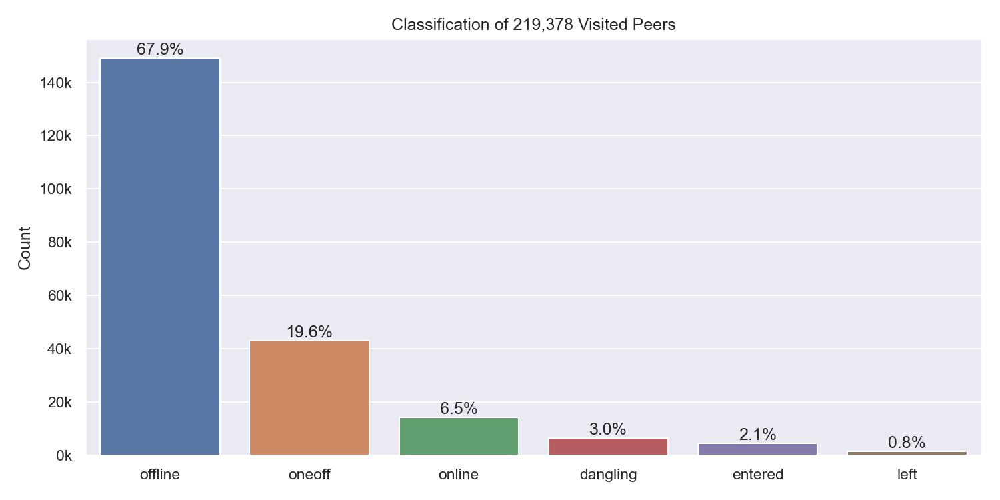
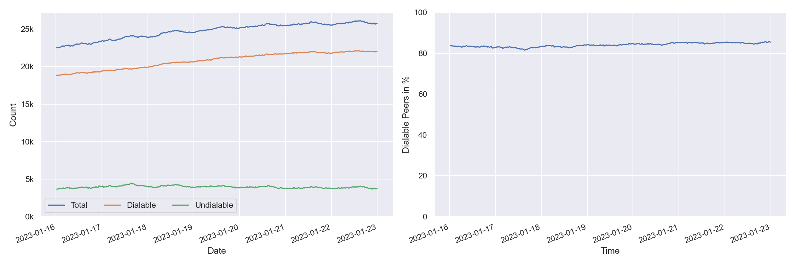
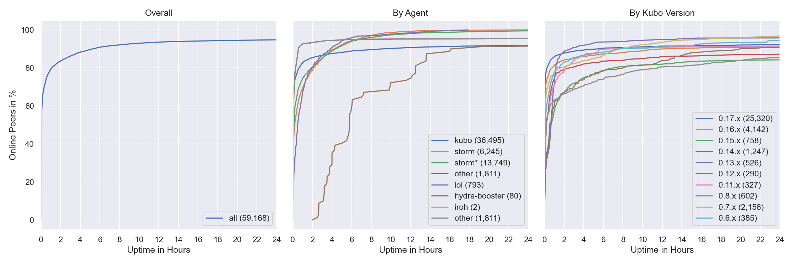
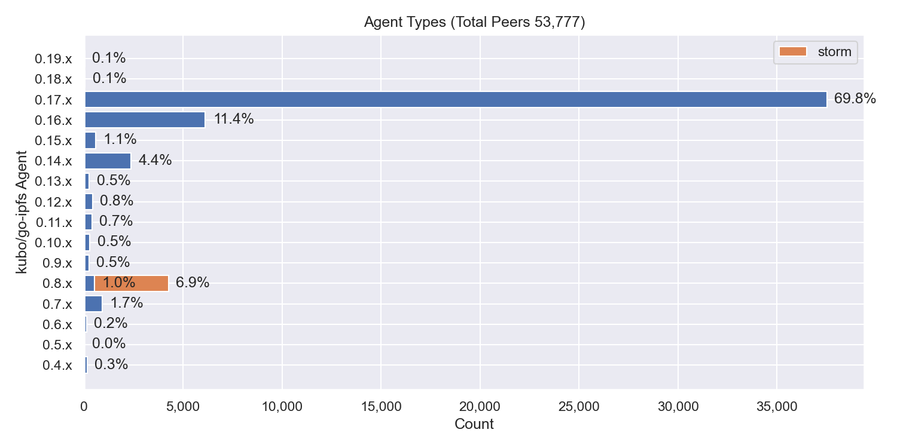
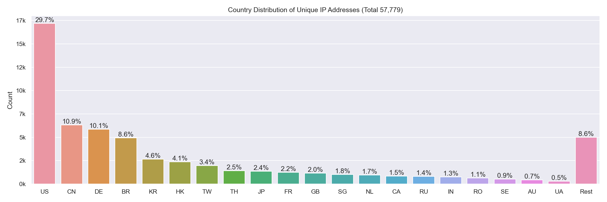
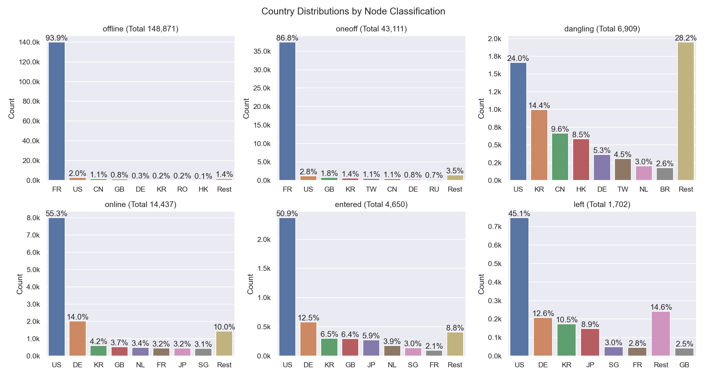
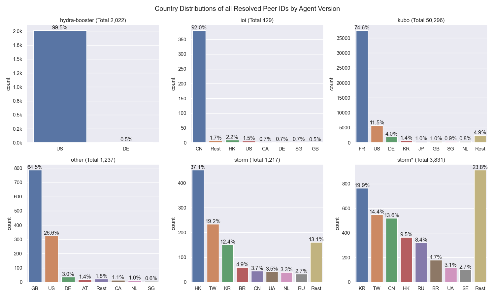
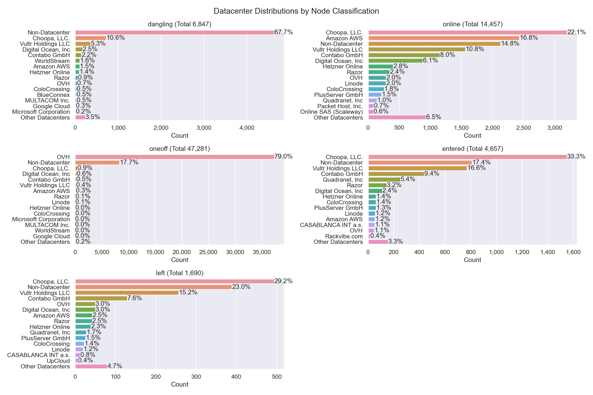
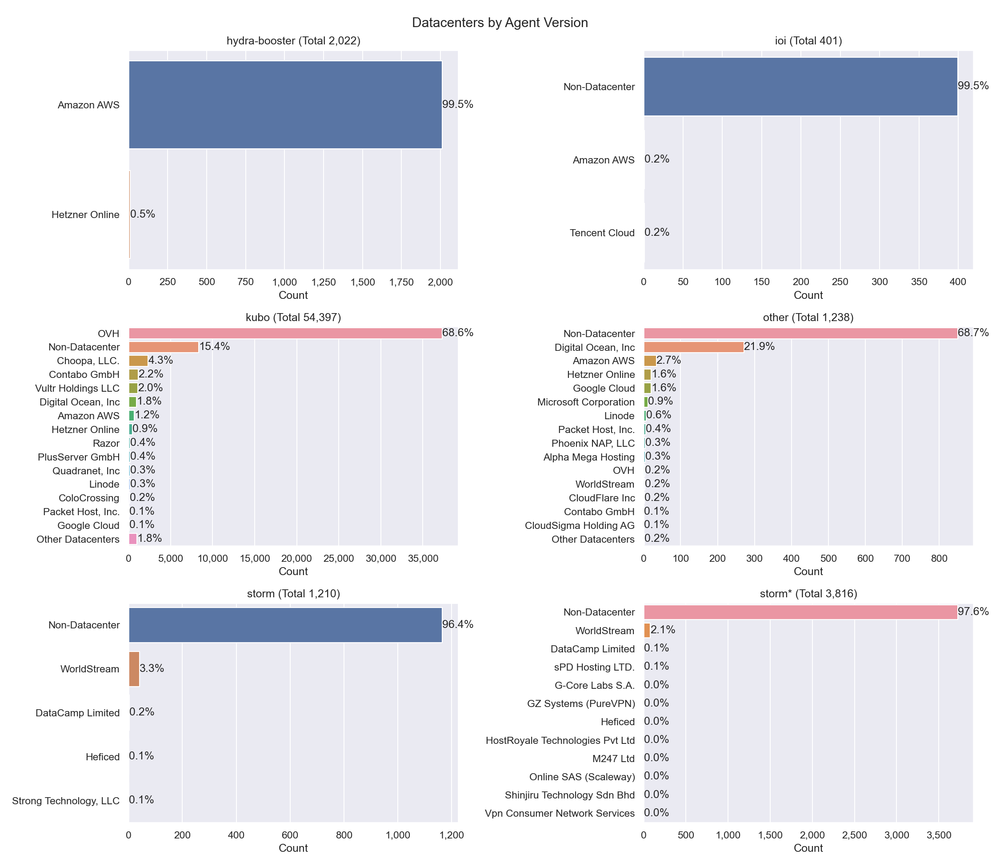

# Nebula Measurement Results Calendar Week 3 - 2023

## Table of Contents

- [Nebula Measurement Results Calendar Week 3 - 2023](#nebula-measurement-results-calendar-week-3---2023)
  - [Table of Contents](#table-of-contents)
  - [General Information](#general-information)
    - [Agent Versions](#agent-versions)
    - [Protocols](#protocols)
    - [Classification](#classification)
    - [Top 10 Rotating Nodes](#top-10-rotating-nodes)
    - [Crawls](#crawls)
      - [Overall](#overall)
      - [Agents](#agents)
  - [Churn](#churn)
  - [Inter Arrival Time](#inter-arrival-time)
  - [Agent Version Analysis](#agent-version-analysis)
    - [Overall](#overall-1)
    - [Kubo](#kubo)
    - [Classification](#classification-1)
  - [Geolocation](#geolocation)
    - [Unique IP Addresses](#unique-ip-addresses)
    - [Classification](#classification-2)
    - [Agents](#agents-1)
  - [Datacenters](#datacenters)
    - [Overall](#overall-2)
    - [Classification](#classification-3)
    - [Agents](#agents-2)
  - [Top Updating Peers](#top-updating-peers)
    - [Peer Classification](#peer-classification)
    - [Storm Specific Protocols](#storm-specific-protocols)

## General Information

The following results show measurement data that were collected in calendar week 3 in 2023 from `2023-01-16` to `2023-01-23`.

- Number of crawls `335`
- Number of visits `38,807,571`
  > Visiting a peer means dialing or connecting to it. Every time the crawler or monitoring process tries to dial or connect to a peer we consider this as _visiting_ it. Regardless of errors that may occur.
- Number of unique peer IDs visited `219,378`
- Number of unique IP addresses found `61,897`

Timestamps are in UTC if not mentioned otherwise.

### Agent Versions

Newly discovered agent versions:

- `middlewareTest@29b3d2ad2-dirty` (2023-01-16 04:21:06)
- `kubo/0.19.0-dev/d90a9b5/docker` (2023-01-16 05:51:40)
- `kubo/0.17.0/d85b1e97e-dirty` (2023-01-16 10:53:17)
- `github.com/ethtweet/ethtweet@a8ecbc145-dirty` (2023-01-17 00:21:38)
- `go-ipfs/0.11.0-dev/0c2f9d595` (2023-01-17 09:22:15)
- `antares/vdev+5f3759df` (2023-01-17 12:23:38)
- `kubo/0.19.0-dev/5d864faac` (2023-01-17 20:53:14)
- `kubo/0.19.0-dev/5d864fa/docker` (2023-01-18 08:52:12)
- `github.com/application-research/estuary@33900d1ce-dirty` (2023-01-18 11:23:40)
- `validation-bot@2c9420826` (2023-01-18 18:23:32)
- `validation-bot@43980326c` (2023-01-18 21:52:42)
- `kubo/0.17.0-dev/052d797ca` (2023-01-18 22:53:34)
- `github.com/application-research/autoretrieve@21fbcfbf1` (2023-01-18 23:51:24)
- `kubo/0.19.0-dev/b88d580b3` (2023-01-19 01:23:37)
- `kubo/0.19.0-dev/73ebad1/docker` (2023-01-19 14:52:03)
- `github.com/application-research/estuary@3be973d84` (2023-01-19 16:21:17)
- `github.com/application-research/estuary@3be973d84-dirty` (2023-01-19 16:21:26)
- `github.com/application-research/estuary@f56257f91` (2023-01-19 17:52:03)
- `github.com/application-research/estuary@139d5106e-dirty` (2023-01-19 19:21:32)
- `github.com/application-research/autoretrieve@f43211081` (2023-01-20 01:52:43)
- `kubo/0.17.0/4485d6b71-dirty` (2023-01-20 20:23:35)
- `kubo/0.19.0-dev/8328bab/docker` (2023-01-20 23:52:31)
- `kubo/0.19.0-dev/c706c63/s̳̪̦̩̝͎͙͝u͍̫̺̝̱̰͝p̠͔̫͓̬̦` (2023-01-21 04:22:05)
- `kubo/0.19.0-dev/12126abf9-dirty` (2023-01-21 17:22:41)
- `kubo/0.19.0-dev/c706c638f-dirty/docker` (2023-01-22 20:23:59)

Agent versions that were found to support at least one [storm specific protocol](#storm-specific-protocols):

- `go-ipfs/0.8.0/48f94e2`
- `storm`

### Protocols

Newly discovered protocols:

- `/qri/ref/0.1.0` (2023-01-16 18:51:30)
- `/qri/profile/0.1.0` (2023-01-16 18:51:30)
- `/metap2p/messageresp/0.0.1` (2023-01-20 08:51:15)
- `/metap2p/pingreq/0.0.1` (2023-01-20 08:51:15)
- `/metap2p/pingresp/0.0.1` (2023-01-20 08:51:15)
- `/metap2p/handshakereq/0.0.1` (2023-01-20 08:51:15)
- `/metap2p/messagereq/0.0.1` (2023-01-20 08:51:15)
- `/metap2p/handshakeresp/0.0.1` (2023-01-20 08:51:15)
- `/metap2p/benckmark/0.0.1` (2023-01-20 08:51:20)
- `/hyprspace/pex/0.0.1` (2023-01-21 01:53:19)

### Classification

In the specified time interval from `2023-01-16` to `2023-01-23` we visited `219,378` unique peer IDs.
All peer IDs fall into one of the following classifications:

| Classification | Description |
| --- | --- |
| `offline` | A peer that was never seen online during the measurement period (always offline) but found in the DHT |
| `dangling` | A peer that was seen going offline and online multiple times during the measurement period |
| `oneoff` | A peer that was seen coming online and then going offline **only once** during the measurement period |
| `online` | A peer that was not seen offline at all during the measurement period (always online) |
| `left` | A peer that was online at the beginning of the measurement period, did go offline and didn't come back online |
| `entered` | A peer that was offline at the beginning of the measurement period but appeared within and didn't go offline since then |

### Top 10 Rotating Nodes

A "rotating node" is a node (as identified by its IP address) that was found to host multiple peer IDs.

| IP-Address    | Country | Unique Peer IDs | Agent Versions | Datacenter IP |
|:------------- |:------- | ---------------:|:-------------- | ------------- |
| `2001:41d0:305:2100::a67` | FR | 4953 | ['kubo/0.17.0/4485d6b71']| True  |
| `51.178.18.118` | FR | 4953 | ['kubo/0.17.0/4485d6b71']| True  |
| `2001:41d0:304:200::de76` | FR | 4893 | ['kubo/0.16.0/38117db6f']| True  |
| `146.59.151.243` | FR | 4893 | ['kubo/0.16.0/38117db6f']| True  |
| `51.91.58.123` | FR | 4791 | ['kubo/0.17.0/4485d6b71']| True  |
| `2001:41d0:305:2100::2f60` | FR | 4791 | ['kubo/0.17.0/4485d6b71']| True  |
| `51.91.59.242` | FR | 4783 | ['kubo/0.17.0/4485d6b71']| True  |
| `2001:41d0:305:2100::2ae1` | FR | 4783 | ['kubo/0.17.0/4485d6b71']| True  |
| `51.178.43.200` | FR | 4599 | ['kubo/0.17.0/4485d6b71']| True  |
| `2001:41d0:304:200::25e6` | FR | 4599 | ['kubo/0.17.0/4485d6b71']| True  |

### Crawls

#### Overall

#### Agents

Only the top 10 kubo versions appear in the right graph (due to lack of colors) based on the average count in the time interval. The `0.8.x` versions **do not** contain disguised storm peers.

`storm*` are `go-ipfs/0.8.0/48f94e2` peers that support at least one [storm specific protocol](#storm-specific-protocols).

## Churn

Only the top 10 kubo versions appear in the right graph (due to lack of colors) based on the average count in the time interval. The `0.8.x` versions **do not** contain disguised storm peers. This graph also excludes peers that were online the whole time. You can read this graph as: if I see a peer joining the network, what's the likelihood for it to stay `X` hours in the network.

`storm*` are `go-ipfs/0.8.0/48f94e2` peers that support at least one [storm specific protocol](#storm-specific-protocols).

## Inter Arrival Time

Only the top 10 kubo versions appear in the right graph (due to lack of colors) based on the average count in the time interval. The `0.8.x` versions **do not** contain disguised storm peers.

`storm*` are `go-ipfs/0.8.0/48f94e2` peers that support at least one [storm specific protocol](#storm-specific-protocols).

## Agent Version Analysis

### Overall

Includes all peers that the crawler was able to connect to at least once: `dangling`, `online`, `oneoff`, `entered`. Hence, the total number of peers is lower as the graph excludes `offline` and `left` peers (see [classification](#peer-classification)).

### Kubo

`storm` shows the `go-ipfs/0.8.0/48f94e2` peers that support at least one [storm specific protocol](#storm-specific-protocols).

### Classification

The classifications are documented [here](#peer-classification).
`storm*` are `go-ipfs/0.8.0/48f94e2` peers that support at least one [storm specific protocol](#storm-specific-protocols).

## Geolocation

### Unique IP Addresses

This graph shows all IP addresses that we found from `2023-01-16` to `2023-01-23` in the DHT and their geolocation distribution by country.

### Classification

The classifications are documented [here](#peer-classification). 
The number in parentheses in the graph titles show the number of unique peer IDs that went into the specific subgraph.

### Agents

`storm*` are `go-ipfs/0.8.0/48f94e2` peers that support at least one [storm specific protocol](#storm-specific-protocols).

## Datacenters

### Overall

This graph shows all IP addresses that we found from `2023-01-16` to `2023-01-23` in the DHT and their datacenter association.

### Classification

The classifications are documented [here](#peer-classification). Note that the x-axes are different.

### Agents

The number in parentheses in the graph titles show the number of unique peer IDs that went into the specific subgraph.

`storm*` are `go-ipfs/0.8.0/48f94e2` peers that support at least one [storm specific protocol](#storm-specific-protocols).

## Top Updating Peers

An "updating peer" is a peer that we observed with multiple agent versions.  

| Peer ID           | Final Agent Version     | Number of Transitions | Distinct Agent Versions | Number of Distinct AVs |
|:----------------- |:------------ | ------------- |:------------ | -------------- |
| `12D3KooWQcDBKQcu...` | `go-ipfs/0.8.0/` | 130  | go-ipfs/0.11.0/ go-ipfs/0.8.0/ | 2 |
| `12D3KooWHPSQJQhE...` | `kubo/0.16.0/38117db` | 125  | kubo/0.14.0/ kubo/0.16.0/38117db | 2 |
| `12D3KooWMy1cRE4t...` | `go-ipfs/0.10.0/` | 116  | go-ipfs/0.10.0/ kubo/0.16.0/ | 2 |
| `12D3KooWNgxATDv4...` | `go-ipfs/0.13.0/` | 96  | go-ipfs/0.13.0/ go-ipfs/0.8.0/ | 2 |
| `12D3KooWFMdbjJR7...` | `go-ipfs/0.11.0/` | 68  | go-ipfs/0.11.0/ kubo/0.17.0/ | 2 |
| `12D3KooWAmVgeLTa...` | `go-ipfs/0.12.0/` | 63  | go-ipfs/0.11.0/ go-ipfs/0.12.0/ | 2 |
| `12D3KooWKxLVDs3N...` | `go-ipfs/0.10.0/` | 48  | go-ipfs/0.10.0/ kubo/0.16.0/ | 2 |
| `12D3KooWK2mqKoGU...` | `kubo/0.19.0-dev/73ebad1/docker` | 3  | kubo/0.19.0-dev/5d864fa/docker kubo/0.19.0-dev/73ebad1/docker kubo/0.19.0-dev/d90a9b5/docker | 3 |
| `12D3KooWLGNuMB1Z...` | `go-ipfs/0.13.1/` | 2  | go-ipfs/0.13.1/ kubo/0.17.0/ | 2 |
| `12D3KooWNTiHg8eQ...` | `github.com/application-research/autoretrieve@f43211081` | 2  | github.com/application-research/autoretrieve@21fbcfbf1 github.com/application-research/autoretrieve@f43211081 | 2 |

### Peer Classification

| Classification | Description |
| --- | --- |
| `offline` | A peer that was never seen online during the measurement period (always offline) but found in the DHT |
| `dangling` | A peer that was seen going offline and online multiple times during the measurement period |
| `oneoff` | A peer that was seen coming online and then going offline **only once** during the measurement period |
| `online` | A peer that was not seen offline at all during the measurement period (always online) |
| `left` | A peer that was online at the beginning of the measurement period, did go offline and didn't come back online |
| `entered` | A peer that was offline at the beginning of the measurement period but appeared within and didn't go offline since then |

### Storm Specific Protocols

The following protocol strings are unique for `storm` nodes according to [this Bitdefender paper](https://www.bitdefender.com/files/News/CaseStudies/study/376/Bitdefender-Whitepaper-IPStorm.pdf):

- `/sreque/*`
- `/shsk/*`
- `/sfst/*`
- `/sbst/*`
- `/sbpcp/*`
- `/sbptp/*`
- `/strelayp/*`